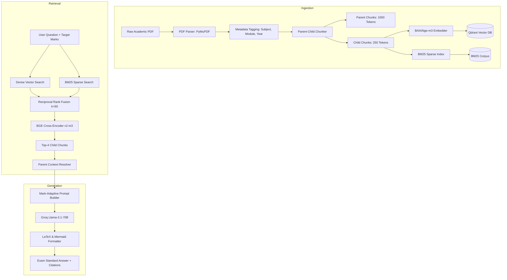

# RAD-UniQA: Retrieval Augmented Documentation for University Question Answers

An advanced NLP system engineered to ingest university reference textbooks, syllabus documents, lecture notes, and past question papers to produce highly accurate, exam-oriented responses.

Unlike generic RAG pipelines, **RAD-UniQA** adapts its response structure, technical depth, and length based on university exam grading schemes (2-mark definitions, 5-mark mechanisms/comparisons, and 10-mark comprehensive derivations with Mermaid architecture diagrams).

---

## 🏛️ System Architecture



---

## 🚀 Quick Start Guide

### 1. Prerequisites
- Python 3.10+
- [Groq API Key](https://console.groq.com/)
- Docker (for Qdrant vector database)

### 2. Setup Virtual Environment
```bash
git clone <repo_url>
cd RAD-UniQA
python -m venv .venv
.venv\Scripts\activate        # Windows
# source .venv/bin/activate   # Linux/macOS
pip install -r requirements.txt
```

### 3. Configure Environment
```bash
cp .env.example .env
```
Edit `.env` and configure your API key:
```env
GROQ_API_KEY=gsk_your_groq_api_key_here
LLM_MODEL=llama-3.1-70b-versatile
QDRANT_URL=http://localhost:6333
```

### 4. Start Qdrant Vector DB
```bash
docker run -d -p 6333:6333 -p 6334:6334 qdrant/qdrant
```

### 5. Ingest Documents
Place your university PDFs in `docs/raw_documents/` (e.g., `NLP_Module_3_Notes_2024.pdf`), then run:
```bash
python scripts/index_documents.py --dir docs/raw_documents --subject NLP
```

### 6. Verify System Compliance
```bash
python scripts/verify_pipeline.py
```

### 7. Launch FastAPI Server
```bash
uvicorn src.api.main:app --host 0.0.0.0 --port 8000 --reload
```

---

## 📡 API Usage

### Query Endpoint: `POST /api/v1/query`

**Request Payload:**
```json
{
  "question": "Explain Transformer Multi-Head Self-Attention mechanism with architecture diagram",
  "subject": "NLP",
  "module_filter": 3,
  "target_marks": 10
}
```

**Response Format:**
```json
{
  "question": "Explain Transformer Multi-Head Self-Attention...",
  "target_marks": 10,
  "generated_answer": "## Section 1: Detailed Introduction\n...\n```mermaid\nflowchart TD\n...\n```\n$$\\text{Attention}(Q,K,V)=\\text{softmax}\\left(\\frac{QK^T}{\\sqrt{d_k}}\\right)V$$\n...",
  "citations": [
    {
      "source": "NLP_Module_3_Notes_2024.pdf",
      "module_number": 3,
      "page_number": 12,
      "snippet": "Multi-head attention allows the model to jointly attend to information..."
    }
  ],
  "retrieval_latency_ms": 185.4
}
```

---

## 🧪 Running Unit Tests

```bash
pytest tests/
```
