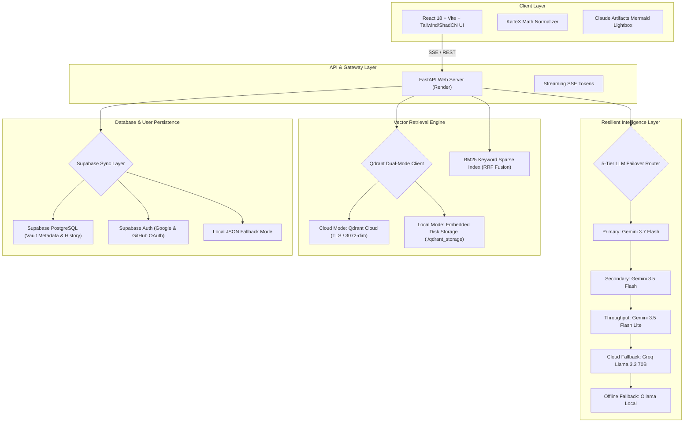

# RAD-UniQA — Autonomous University Exam Intelligence & RAG Platform

> **RAD-UniQA** is an enterprise-grade Retrieval-Augmented Generation (RAG) platform designed specifically for university examination preparation, past-year question (PYQ) analysis, automated exam paper generation, and interactive syllabus search.

---

## 🏗️ System Architecture



---

## 🧠 Why We Chose X over Y (Technical Rationale)

### 1. Qdrant Embedded/Cloud Dual-Mode vs. Docker Only
- **Why Docker previously?** Early development used Qdrant running in a standalone Docker container (`http://localhost:6333`). While Docker is great for isolation, requiring users or cloud servers to run Docker containers creates massive overhead, increases RAM usage, and prevents deploying to free-tier cloud environments like Render.
- **Why Dual-Mode Embedded + Cloud?** 
  - **Local Development**: Python's `qdrant-client` runs in **embedded disk mode** (`QdrantClient(path="./qdrant_storage")`). It reads vectors directly from disk in-process with **zero Docker requirement** and sub-5ms latency.
  - **Cloud Production**: Simply setting `QDRANT_URL` and `QDRANT_API_KEY` connects the app over TLS to **Qdrant Cloud Free Tier** (1GB cluster), giving permanent multi-user vector storage with zero Render memory consumption.

### 2. Qdrant Dedicated Vector DB vs. Supabase `pgvector`
- **Why Qdrant for RAG**: Qdrant is a Rust-based, specialized vector engine. It handles high-dimensional vectors (Gemini 2 generates 3,072 dimensions) with native HNSW indexing, SIMD acceleration, and built-in hybrid search (dense vectors + sparse BM25) at sub-10ms speeds.
- **Why Supabase for Metadata & Auth**: While `pgvector` works for basic search, relational databases require heavy RAM for 3,072-dim HNSW indexes. Instead, we use Supabase for what it does best: **User OAuth (Google/GitHub)**, **Document Vault Metadata**, **Saved Questions**, and **User History**, while offloading vector math to Qdrant.

### 3. 5-Tier Resilient LLM Router vs. Single LLM Provider
- **The Problem**: Relying on a single LLM API leads to system crashes when encountering `429 Rate Limits`, `503 Service Unavailable`, or `ResourceExhausted` errors during peak usage.
- **Our Solution**: A 5-tiered dynamic failover chain (`Gemini 3.7 Flash` $\rightarrow$ `Gemini 3.5 Flash` $\rightarrow$ `Gemini 3.5 Flash Lite` $\rightarrow$ `Groq Llama 3.3 70B` $\rightarrow$ `Ollama Local`). If an API fails or rate-limits, the system falls back in < 200ms without the user ever seeing an error.

### 4. Cloud Gemini Embedding 2 vs. Heavy Local PyTorch (CUDA)
- **The Problem**: Standard `sentence-transformers` requires installing PyTorch with CUDA drivers (**2.8 GB download**), causing cloud deployment builds to run out of memory or time out after 18 minutes.
- **Our Solution**:
  - **Cloud Mode**: Uses `models/gemini-embedding-2` via API. It generates superior 3,072-dimensional technical embeddings on Google's infrastructure with **0 server RAM cost**.
  - **Local/Render Build**: We added `--extra-index-url https://download.pytorch.org/whl/cpu` for lightweight (~120 MB) CPU-only fallback, allowing Render builds to complete using `uv` in under 30 seconds!

---

## ⚡ Speed & Latency Comparison: Local vs. Cloud Hosted

| Component | Local Execution (PC) | Cloud Production (Render + Vercel) | Best For |
| :--- | :--- | :--- | :--- |
| **Vector Search (Qdrant)** | **⚡ ~3 – 8 ms** (In-process disk read) | **~20 – 45 ms** (Network RTT to Qdrant Cloud) | **Local** is fastest for single-dev; **Cloud** is best for zero data loss on restarts |
| **LLM Generation** | ~1.5s - 3.5s (Gemini 3.7 SSE Stream) | ~1.5s - 3.5s (Gemini 3.7 SSE Stream) | Equal (Both call Google APIs) |
| **Server RAM Usage** | ~280 MB | ~240 MB (Well under Render 512MB limit) | Both lightweight |
| **Build / Deploy Time** | N/A | **< 45 Seconds** (via `uv` package installer) | **Cloud** |

---

## 🛠️ Project Directory Structure

```text
RAD-UniQA/
├── docs/
│   ├── processed_chunks/    # BM25 corpus and parent document store
│   └── raw_documents/       # Syllabus PDFs and course materials
├── frontend/                # React 18 + Vite + Tailwind CSS + ShadCN UI
│   ├── src/
│   │   ├── components/      # UI components, Mermaid Viewer Modal, KaTeX Renderer
│   │   ├── pages/           # Landing page & Intelligence Console tabs
│   │   ├── App.jsx          # Main application & Markdown Normalizer
│   │   └── index.css        # ShadCN Zinc-950 design system tokens
│   └── vercel.json          # SPA routing configuration for Vercel
├── qdrant_storage/          # Embedded local Qdrant vector database
├── src/
│   ├── api/                 # FastAPI routes (QA, Mock Gen, History, Predictor)
│   ├── generator/           # LLM Router & 5-tier failover chains & prompts
│   ├── ingestion/           # PDF parsing, metadata extraction, chunking
│   ├── intelligence/        # Supabase sync helpers & analytics
│   ├── retriever/           # Qdrant client & Gemini Embedding 2 integration
│   └── config.py            # Global Settings & Pydantic validation
├── tests/                   # Automated unit tests for Failover & Normalizer
├── render.yaml              # Render Web Service blueprint specification
└── requirements.txt         # Fast CPU-optimized Python dependency list
```

---

## 🚀 Deployment Guide

### 1. Backend Deployment (Render)
1. Create a **New Web Service** on Render connected to `RatishPatil37/Eduniti`.
2. Configure settings:
   - **Root Directory**: `RAD-UniQA`
   - **Build Command**: `pip install uv && uv pip install --system -r requirements.txt`
   - **Start Command**: `uvicorn src.api.main:app --host 0.0.0.0 --port $PORT`
3. Environment Variables:
   - `GEMINI_API_KEY`: `<your_gemini_api_key>`
   - `GROQ_API_KEY`: `<your_groq_api_key>`
   - `SUPABASE_URL`: `<your_supabase_project_url>`
   - `SUPABASE_KEY`: `<your_supabase_anon_key>`
   - `QDRANT_URL`: `https://<cluster-id>.us-east4-0.gcp.cloud.qdrant.io:6333` *(optional)*
   - `QDRANT_API_KEY`: `<your_qdrant_api_key>` *(optional)*

### 2. Frontend Deployment (Vercel)
1. Create a **New Project** on Vercel connected to `RatishPatil37/Eduniti`.
2. Select **Vite** preset and set **Root Directory** to `RAD-UniQA/frontend`.
3. Add Environment Variables:
   - `VITE_API_BASE`: `https://your-backend.onrender.com`
   - `VITE_SUPABASE_URL`: `https://<your_supabase_id>.supabase.co`
   - `VITE_SUPABASE_ANON_KEY`: `<your_supabase_anon_key>`

---

## 💻 Local Development Setup

1. **Clone Repository**:
   ```bash
   git clone https://github.com/RatishPatil37/Eduniti.git
   cd Eduniti/RAD-UniQA
   ```

2. **Backend Setup**:
   ```bash
   python -m venv .venv
   .venv\Scripts\activate
   pip install -r requirements.txt
   python -m uvicorn src.api.main:app --reload --port 8000
   ```

3. **Frontend Setup**:
   ```bash
   cd frontend
   npm install
   npm run dev
   ```

4. Open `http://localhost:5173` in your browser.

---

## 📜 License & Acknowledgments

Developed with ❤️ for University Academic Excellence. Powered by **Google Gemini**, **Qdrant**, **Supabase**, **FastAPI**, and **React**.
