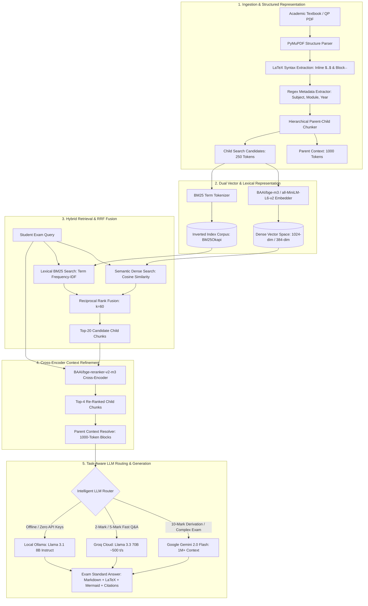

# RAD-UniQA: Technical NLP Viva, Presentation & Deep-Dive Script
### *Theoretical Foundations, Mathematical Formulations, and Architectural Insights*

---

## 1. Project Overview & Elevator Pitch

> *"RAD-UniQA (Retrieval-Augmented Documentation for University Question Answering) is an enterprise-grade NLP architecture specifically engineered for academic syllabus comprehension and exam-oriented reasoning.*
> 
> *Generic RAG architectures suffer from three critical academic bottlenecks: loss of mathematical LaTeX syntax during PDF extraction, context dilution from naive fixed-character chunking, and generic conversational outputs that disregard university grading rubrics (e.g., Bloom's Taxonomy).*
> 
> *RAD-UniQA solves these challenges through a dual-path hybrid retrieval engine (Dense BGE-M3 + Sparse BM25 fused via Reciprocal Rank Fusion), BGE Cross-Encoder re-ranking, Hierarchical Parent-Child chunking (1000/250 tokens), and an Intelligent Task-Aware LLM Router that adapts response depth according to 2-mark definitions, 5-mark mechanisms, and 10-mark architectural derivations with Mermaid diagrams."*

---

## 2. Deep-Dive NLP Technical Pipeline

---

## 3. Core NLP Algorithms & Mathematical Formulations

### 3.1 Dense Semantic Embeddings (Cosine Similarity)
Dense representation maps variable-length academic queries $\vec{q}$ and document passages $\vec{v}$ into a shared continuous vector space $\mathbb{R}^d$:

$$\text{Similarity}_{\text{dense}}(\vec{q}, \vec{v}) = \frac{\vec{q} \cdot \vec{v}}{\|\vec{q}\| \|\vec{v}\|} = \frac{\sum_{i=1}^{n} q_i v_i}{\sqrt{\sum_{i=1}^{n} q_i^2} \sqrt{\sum_{i=1}^{n} v_i^2}}$$

* **Why it matters in NLP:** Captures semantic synonyms and conceptual similarity (e.g., connecting *"self-attention"* to *"transformer query-key mapping"*) even if exact keywords differ.

---

### 3.2 Sparse Lexical Retrieval (BM25Okapi)
While dense embeddings excel at semantic concepts, they often struggle with rare university jargon, acronyms (e.g., *BERT, LSTM, BLEU, ROUGE*), and theorem names. BM25 scores document relevance $D$ against query $Q = \{q_1, q_2, \dots, q_n\}$:

$$\text{Score}_{\text{BM25}}(D, Q) = \sum_{i=1}^{n} \text{IDF}(q_i) \cdot \frac{f(q_i, D) \cdot (k_1 + 1)}{f(q_i, D) + k_1 \cdot \left(1 - b + b \cdot \frac{|D|}{\text{avgdl}}\right)}$$

$$\text{IDF}(q_i) = \ln \left(\frac{N - n(q_i) + 0.5}{n(q_i) + 0.5} + 1\right)$$

* Where $k_1 = 1.2$ (term saturation limit) and $b = 0.75$ (document length normalization).

---

### 3.3 Reciprocal Rank Fusion (RRF)
To fuse the dense and sparse candidate rankings without requiring arbitrary calibration of different score scales, we implement **Reciprocal Rank Fusion**:

$$\text{RRF\_Score}(d \in D) = \sum_{m \in \{\text{Dense}, \text{Sparse}\}} \frac{1}{k + r_m(d)}$$

* $r_m(d)$ is the 1-based rank position of document $d$ in retrieval system $m$.
* $k = 60$ is the smoothing constant that prevents outliers from dominating the candidate pool.

---

### 3.4 Cross-Encoder Re-Ranking
Unlike bi-encoders (which compute embeddings independently), the cross-encoder performs **full all-to-all cross-attention** between the query and candidate chunk tokens:

$$\text{Score}_{\text{cross}}(Q, D) = \sigma\left(W \cdot \text{Transformer}([CLS] \circ Q \circ [SEP] \circ D)\right)$$

* Eliminates marginal false-positive candidates before LLM prompt assembly.

---

### 3.5 Hierarchical Parent-Child Chunking Strategy
* **The Problem:** Small chunks (e.g., 200 tokens) yield accurate vector similarity search but lack the surrounding paragraphs needed to explain mathematical steps. Large chunks (e.g., 1000 tokens) dilute embedding vectors and reduce retrieval recall.
* **Our Solution:** Search is performed against **Child Chunks (250 tokens)**. Once top candidates are selected, the system resolves and loads their **Parent Chunks (1000 tokens)** into the LLM prompt.

---

## 4. Key Viva Questions & Answers (NLP Project Defense)

#### Q1: Why did you choose Hybrid Search instead of Dense Vector Search alone?
> **Answer:** *"Dense vector search alone suffers from the 'out-of-vocabulary and acronym blindness' problem in technical domains. For example, queries containing acronyms like 'GloVe vs Word2Vec' or exact formula names can have suboptimal dense representations. By coupling dense semantic retrieval with sparse BM25 lexical token matching and fusing them via Reciprocal Rank Fusion (RRF), we achieve high recall on both semantic concepts and exact university terminology."*

#### Q2: How does RAD-UniQA prevent LLM hallucinations?
> **Answer:** *"First, we implement an explicit fallback trigger: if retrieved document chunks lack verified evidence, the system outputs our strict fallback token: `Insufficient Document Context`. Second, every generated statement is grounded with mandatory source citations referencing the exact PDF filename, syllabus module, and page number."*

#### Q3: What is the purpose of the Intelligent LLM Router?
> **Answer:** *"Different academic tasks require different compute profiles. Generating a 10-mark mathematical derivation with a Mermaid diagram requires high reasoning capacity and large context windows (routed to Google Gemini 2.0 Flash). Conversely, quick 2-mark definitions and practice mode evaluation require sub-second latency (routed to Groq Cloud at ~500 tokens/sec). If offline, the router seamlessly falls back to our local Ollama instance."*

#### Q4: How does Parent-Child Chunking improve retrieval quality?
> **Answer:** *"In NLP, embedding a large 1000-token chunk causes semantic dilution because the embedding vector averages multiple distinct topics. Child chunks of 250 tokens preserve high semantic granularity. When a child chunk matches the query, we fetch its 1000-token parent block to provide the LLM with full context for structured answer generation."*
